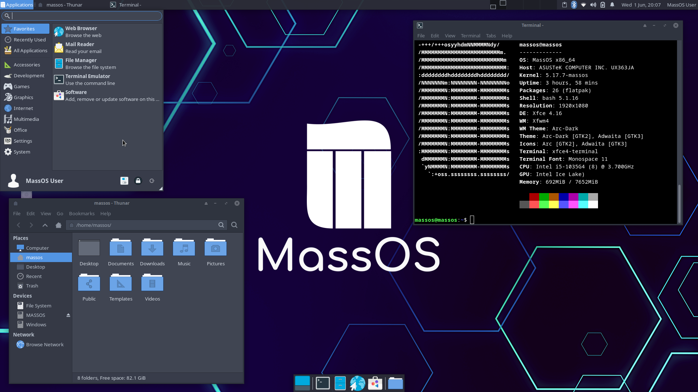

# Welcome To MassOS
Welcome to **MassOS**, a [free](https://www.gnu.org/philosophy/free-sw.html) GNU/Linux operating system for x86_64 devices, which aims to be minimal and lightweight, without compromising features. It uses the [Xfce](https://xfce.org) desktop environment.

The MassOS system itself is under 5 gigabytes. Quite impressive for a GNU/Linux distribution containing a full desktop environment and common programs, as well as development tools/headers. Some distributions are able to achieve minimalism by using smaller replacements for common GNU software, at the cost of some features. With MassOS, you get the minimal size, without compromising the advanced features exclusive to GNU software.
# Not Based On Any Other Distro
MassOS is completely independent and compiled from _source_. It does not use a "traditional" package manager (like DPKG or RPM).

The MassOS base system itself already contains a large selection of software which should suit most users. Instead of using a traditional package manager, the universal **Flatpak** package manager (complemented by the GUI Gnome Software centre) can be used to install GUI-based software. AppImages are also supported. Additionally, developer-orientated users may also wish to compile software themselves, since the necessary development tools/headers are retained in the system.

# Installing MassOS
Starting from version **2021.11**, MassOS has a guided installation program which can be used to easily install MassOS.

Please see the [installation guide](installation-guide.md) for more information, and installation instructions.

Unlike most GNU/Linux distributions, MassOS is not installed from a live CD. Instead, you download the root filesystem tarball and extract/install it manually. The latest release can be found on the [releases page](https://github.com/TheSonicMaster/MassOS/releases). If this seems complicated, don't worry! The [installation guide](installation-guide.md) has step-by-step instructions on how to install MassOS.

Some developers may also wish to [build MassOS themselves](building.md) using the scripts in this repo. This is not recommended for most users.
# About This Repo
This repo contains the scripts which are used to build the complete MassOS system. Most people won't want to run these. Instead, you can download the latest release tarball of MassOS from the [releases page](https://github.com/TheSonicMaster/MassOS/releases).
# Releases
The latest release of MassOS is **2021.10.2**.

Release numbers follow the format **YYYY.MM**. For example: the August 2021 release will be **2021.08**. On a working MassOS system, you can check the version by running `massos-release`. There is a new release of MassOS roughly once or twice per month. New releases will usually include updated software. A new release in the same month as an existing release will be in the format **YYYY.MM.2**. You can upgrade an existing MassOS installation by using the [MassOS Upgrade Utility](https://github.com/TheSonicMaster/massos-upgrade).

Developers who wish to test out some of the latest in-development features for the next version MassOS can take a look at the [development branch](https://github.com/TheSonicMaster/MassOS/tree/development).
